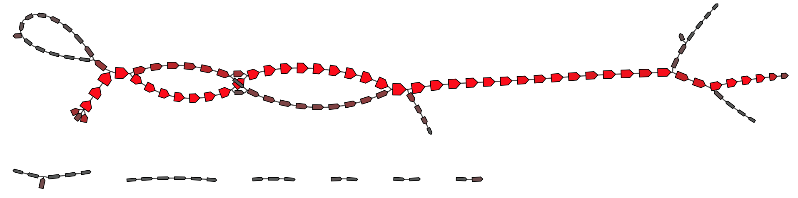

# Adapter assembler

This is a very simple De Bruijn graph assembler I made for finding adapter sequences in long read sets. It takes one or more files of long reads as input and outputs a [GFA](https://github.com/GFA-spec/GFA-spec) assembly graph.

It works by building a DeBruijn graph using just the starts or ends of long reads. It uses a small k-mer and filters out low-abundance k-mers, so only sequences common to many reads (i.e. adapters) are left in the graph. You can then use [Bandage](https://github.com/rrwick/Bandage) to visualise the graph and extract adapter sequences using its 'Merge selected nodes' and 'Copy selected path sequence' functions.

This is a no-frills tool that isn't really suitable for any other purpose I can think of. Don't use it as a general assembler – there are plenty of real assemblers out there which are more appropriate!


## Requirements

* Linux or macOS
* C++ compiler (GCC 4.8 or later should work)
* zlib (usually included with Linux/macOS)
* [Bandage](https://github.com/rrwick/Bandage) (not required to run the tool but very helpful for making use of the output)


## Installation

This tool builds into a stand-alone executable:
```
git clone https://github.com/rrwick/Adapter-assembler.git
cd Adapter-assembler
make -j
bin/adapter_assembler -h
```


## Quick usage

You must use either the `--start` option (to assemble start-of-read adapters) or `--end` (to assemble end-of-read adapters):

```
adapter_assembler --start input_reads.fastq > start.gfa
adapter_assembler --end input_reads.fastq > end.gfa
```


## Example results

In these examples, I have visualised the resulting assembly graph in Bandage and used the 'Colour by depth' mode to make high-depth k-mers stand out as red.

#### `start.gfa`

<p align="center"></p>

The adapter 'fades in' in this graph because the beginning of the adapter sequence is more likely to be cut off at read starts. This makes the exact beginning of the adapter a bit unclear. The end of the adapter is clear where the graph splits into multiple branches on the right.


#### `end.gfa`

<p align="center"></p>

This graph is the opposite: the adapter start is clear on the left because multiple branches join together, and its end 'fades out'.


## Full usage

```
usage: adapter_assembler {OPTIONS} [input_reads...]

Adapter-assembler: a tool for extracting adapter sequences from long reads

positional arguments:
    input_reads...                      input long reads for adapter assembly

optional arguments:
    -k[int], --kmer [int]               k-mer size for assembly (default: 10)
    -d[float], --filter_depth [float]   k-mers with depth lower than this fraction of the max depth will be filtered out (default: 0.05)
    -m[int], --margin [int]             number of bases to use from start/end of read (default: 250)
    --start                             assemble bases from start of reads
    --end                               assemble bases from end of reads
    --version                           display the program version and quit

    -h, --help                          display this help menu

For more information, go to: https://github.com/rrwick/Adapter-assembler
```


## License

[GNU General Public License, version 3](https://www.gnu.org/licenses/gpl-3.0.html)
